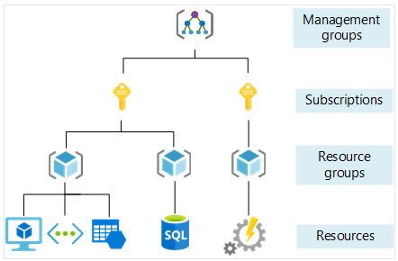

<!-- BEGIN_TF_DOCS -->
# Azure Resource Group Terraform Module

## Overview
An Azure Resource Group is a logical container within Microsoft Azure that allows you to organize and manage related resources for a specific solution or project. It is an essential part of Azure's management structure and provides a framework to group and manage Azure resources like virtual machines, storage accounts, web apps, databases, and more.

## Key Features and Concepts of Azure Resource Groups:

### Logical Grouping:

Resource groups allow you to manage resources collectively, making it easier to deploy, update, and monitor resources that work together.

For example, all resources for a web application, including a database, virtual network, and storage, can be grouped together.

### Lifecycle Management:

Resources within a group can share the same lifecycle, meaning they can be created, updated, and deleted together.
Deleting a resource group removes all resources contained within it.

### Access Control:

Azure Role-Based Access Control (RBAC) can be applied at the resource group level to manage access permissions for all resources within the group.
This simplifies governance by allowing you to control access collectively.

### Cost Management:

Costs for resources in a group can be tracked collectively, making it easier to attribute and manage expenses for a particular project or solution.

### Location Dependency:

Each resource group is associated with a specific Azure region, though the resources within the group can reside in different regions.
The location determines where the metadata for the group is stored, which can affect compliance and performance.

### Tags for Organization:

You can apply tags (key-value pairs) to a resource group or individual resources to organize and categorize them for better management and reporting.

### Dependencies and Relationships:

Resources in a resource group can be interdependent but don't have to be. A resource in one group can interact with a resource in another.

### Templates for Deployment:

Azure Resource Manager (ARM) templates allow you to define the infrastructure and configuration for resources in a resource group as code.
These templates help in consistent deployments and enable Infrastructure as Code (IaC) practices.

### Use Cases:

Application Development: Group all resources related to a development, testing, or production environment.
Project Organization: Consolidate resources for a project to simplify management and monitoring.
Scaling Solutions: Use resource groups to quickly replicate or scale similar configurations across environments.

### Best Practices:
Resource Segmentation:
Group resources logically based on their function, lifecycle, or team ownership.

### Access Management:
Apply RBAC and use Azure Policies to ensure security and compliance at the group level.

### Tagging:
Consistently use tags for resource groups to facilitate better cost management and resource tracking.

### Regional Considerations:
Choose a region for the resource group that aligns with compliance, latency, and performance requirements.

## Diagram


Resource Group
   ├── Virtual Machine (VM1)
   ├── Storage Account (Storage1)
   ├── SQL Database (DB1)
   └── Virtual Network (VNet1)

## Links
[Microsoft Documentation](https://learn.microsoft.com/en-us/azure/azure-resource-manager/management/overview#resource-groups)

## Requirements

| Name | Version |
|------|---------|
| <a name="requirement_terraform"></a> [terraform](#requirement\_terraform) | ~> 1.0 |
| <a name="requirement_azurerm"></a> [azurerm](#requirement\_azurerm) | ~> 4.0 |
| <a name="requirement_random"></a> [random](#requirement\_random) | 3.6.3 |

## Providers

| Name | Version |
|------|---------|
| <a name="provider_azurerm"></a> [azurerm](#provider\_azurerm) | 4.13.0 |
| <a name="provider_random"></a> [random](#provider\_random) | 3.6.3 |

# Examples

```hcl
# example variables.tf
variable "env" {
  description = "The environment of the resource group."
  type        = string
  default     = "dev"
}

variable "location" {
  description = "The location the resource group should be deployed"
  type        = string
  default     = "northeurope"
}

# example main.tf
module "default_name_rg" {
  source   = "../.."
  env      = var.env
  location = var.location
  tags = {
    environment = var.env
  }
}
```

## Resources

| Name | Type |
|------|------|
| [azurerm_resource_group.this](https://registry.terraform.io/providers/hashicorp/azurerm/latest/docs/resources/resource_group) | resource |
| [random_id.name](https://registry.terraform.io/providers/hashicorp/random/3.6.3/docs/resources/id) | resource |

## Inputs

| Name | Description | Type | Default | Required |
|------|-------------|------|---------|:--------:|
| <a name="input_location"></a> [location](#input\_location) | (Required) The Azure Region where the Resource Group should exist. | `string` | n/a | yes |
| <a name="input_env"></a> [env](#input\_env) | (Required) The environment of the resource group, prd, tst, dev. Required for default naming. | `string` | `null` | no |
| <a name="input_managed_by"></a> [managed\_by](#input\_managed\_by) | (Optional) The ID of the resource or application that manages this Resource Group. | `string` | `null` | no |
| <a name="input_name"></a> [name](#input\_name) | (Required) The Name which should be used for this Resource Group. | `any` | `null` | no |
| <a name="input_tags"></a> [tags](#input\_tags) | (Optional) A mapping of tags which should be assigned to the Resource Group. | `map(string)` | `{}` | no |

## Outputs

| Name | Description |
|------|-------------|
| <a name="output_id"></a> [id](#output\_id) | The ID for this Resource Group. |
| <a name="output_location"></a> [location](#output\_location) | The ID for this Resource Group. |
| <a name="output_name"></a> [name](#output\_name) | The Name for this Resource Group. |
<!-- END_TF_DOCS -->